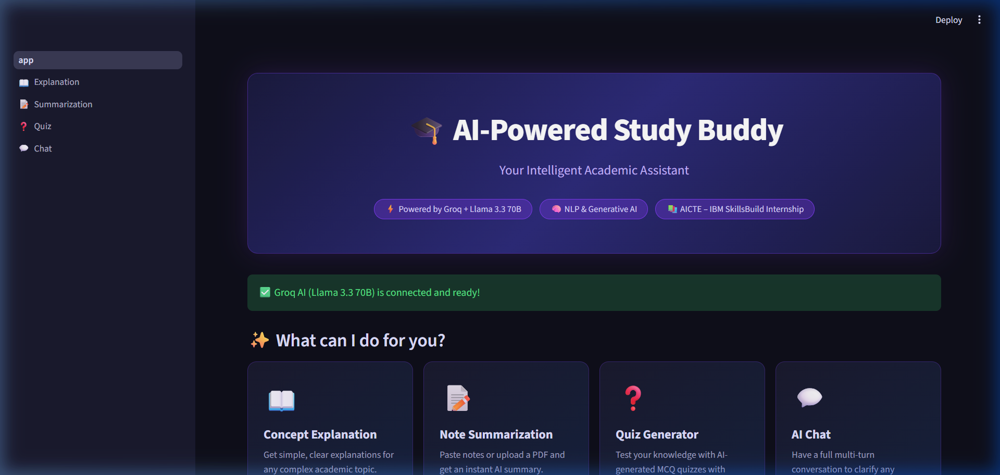
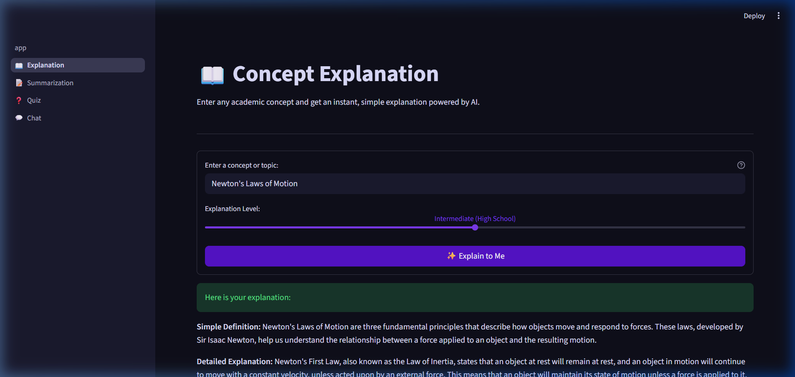
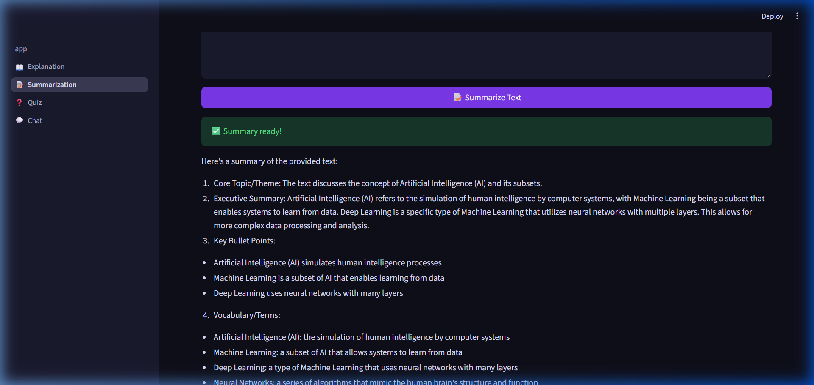
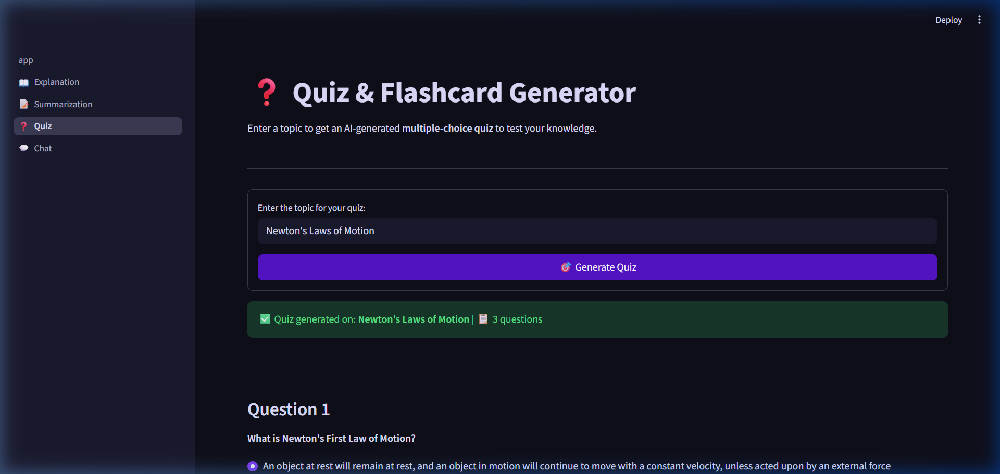
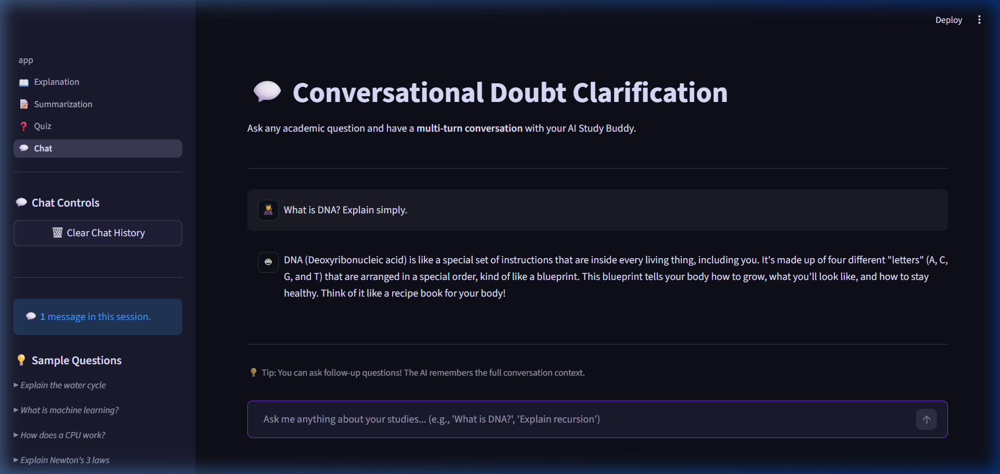

# 📚 AI-Powered Study Buddy

[](https://www.python.org/)
[](https://streamlit.io/)
[](https://groq.com/)
[](https://aicte-india.org/)

## 🚀 Overview

AI-Powered Study Buddy is an intelligent academic assistant designed to help students understand complex concepts more efficiently. The system leverages **Generative AI (Groq + Llama 3.3 70B)** and **Natural Language Processing** to provide:

- 📖 Simple Concept Explanations at adjustable difficulty levels
- 📝 Automatic Note Summarization from text or PDF uploads
- ❓ Interactive AI-generated multiple-choice quizzes with scoring
- 💬 Full multi-turn Conversational Doubt Clarification

This project was developed as part of the **AICTE – IBM SkillsBuild 6-Week Internship Program**.

---

## 🎯 Problem Statement

Students often struggle with:
- Understanding complex academic concepts
- Searching through lengthy and irrelevant online resources
- Lack of immediate access to instructors
- Difficulty creating structured study notes

There is a need for an AI-based assistant that simplifies learning and provides structured academic support on demand.

---

## 💡 Proposed Solution

The AI Study Buddy provides an end-to-end intelligent assistant that:
- Explains concepts in simple, beginner-friendly terms
- Summarizes lengthy notes or uploaded PDFs instantly
- Generates adaptive quizzes to reinforce learning
- Answers follow-up doubts in a multi-turn conversation
- Reduces study time while improving understanding and retention

---

## 🏗️ System Architecture

```
User Input (Topic / Notes / PDF Upload)
              ⬇
   Streamlit Web Interface (Frontend)
              ⬇
   Python Backend (utils/ai_agent.py)
              ⬇
   Groq API → Llama 3.3 70B (AI Model)
              ⬇
   Post-Processing (JSON Parsing, Formatting)
              ⬇
   Output (Explanation + Summary + Quiz + Chat)
```

---

## 🛠️ Technology Stack

| Technology | Purpose |
|---|---|
| Python 3.9+ | Backend Language |
| Streamlit | Web Application Frontend |
| Groq API (`llama-3.3-70b-versatile`) | Generative AI Core |
| PyPDF2 | PDF text extraction |
| python-dotenv | API key management |
| GitHub | Version Control |

---

## 📸 Screenshots

### 🏠 Home Page


### 📖 Concept Explanation


### 📝 Note Summarization


### ❓ Quiz Generator


### 💬 AI Chat


---

## 🏗️ Project Structure

```
AI-Powered-Study-Buddy/
│
├── app.py                          # Main Streamlit homepage
├── requirements.txt                # Python dependencies
├── .env                            # Local API key (do NOT upload to GitHub!)
├── .gitignore                      # Files excluded from Git
├── README.md                       # Project documentation
│
├── screenshots/                    # App UI screenshots
│
├── .streamlit/
│   ├── config.toml                 # Dark purple theme settings
│   └── secrets.toml                # API key for Streamlit Cloud (gitignored)
│
├── pages/
│   ├── 1_📖_Explanation.py         # Concept explanation feature
│   ├── 2_📝_Summarization.py       # Note summarization + PDF upload
│   ├── 3_❓_Quiz.py                # Quiz generation + scoring
│   └── 4_💬_Chat.py               # Multi-turn AI conversation
│
└── utils/
    ├── __init__.py
    ├── ai_agent.py                 # Groq API integration wrapper
    └── prompts.py                  # AI prompt templates
```

---

## ⚙️ How It Works

1. User enters a topic or uploads lecture notes (text/PDF).
2. Python backend formats the input into an AI prompt.
3. Groq API with Llama 3.3 70B generates:
   - Concept explanation (structured with definition, analogy, key points)
   - Key point summary (core topic, bullet points, vocabulary)
   - Quiz questions (MCQ format with answers and explanations)
   - Conversational responses (multi-turn, context-aware)
4. Results are formatted and displayed in the Streamlit web interface.

---

## ⚙️ Local Setup Instructions

### 1. Clone the Repository
```bash
git clone https://github.com/nikhitadasari26/AI-Powered-Study-Buddy.git
cd AI-Powered-Study-Buddy
```

### 2. Create a Virtual Environment
```powershell
python -m venv venv
.\venv\Scripts\Activate      # Windows
# source venv/bin/activate   # Mac/Linux
```

### 3. Install Dependencies
```bash
pip install -r requirements.txt
```

### 4. Get Your Free Groq API Key
- Go to **[https://console.groq.com/](https://console.groq.com/)**
- Sign in with your Google account
- Click **"API Keys"** → **"Create API Key"**
- Copy the key (starts with `gsk_...`)

### 5. Configure Your API Key
Create a `.env` file in the root directory:
```
GROQ_API_KEY=your_groq_api_key_here
```

### 6. Run the App
```bash
streamlit run app.py
```
Opens at → **http://localhost:8501**

---

## ☁️ Streamlit Cloud Deployment

1. Push the project code to a **public GitHub repository**
   _(Make sure `.env` and `.streamlit/secrets.toml` are NOT pushed — they're in `.gitignore`)_
2. Go to **[https://share.streamlit.io/](https://share.streamlit.io/)** and sign in with GitHub
3. Click **"New App"** → select your repo → set Main file: `app.py`
4. In **App Settings → Secrets**, add:
   ```toml
   GROQ_API_KEY = "your_groq_api_key_here"
   ```
5. Click **Deploy!** 🚀

---

## 📊 Features

| Feature | Description |
|---|---|
| 📖 **Concept Explanation** | Explains any academic topic at Beginner, Intermediate, or Advanced level |
| 📝 **Note Summarization** | Summarizes pasted text or uploaded PDFs with bullet-point key takeaways |
| ❓ **Quiz Generator** | Creates 3 MCQ questions with scoring, answer checking, and explanations |
| 💬 **AI Chat** | Multi-turn AI conversation with full memory of previous questions |

---

## 🔮 Future Scope

- 🎙️ Voice-based interaction (Speech-to-Text + Text-to-Speech)
- 🌍 Multilingual support
- 📊 Student performance tracking dashboard
- 🎓 LMS (Learning Management System) integration
- 📱 Mobile application support

---

## 📚 References

- [Groq Documentation](https://console.groq.com/docs)
- [Streamlit Documentation](https://docs.streamlit.io/)
- [Python Official Documentation](https://docs.python.org/)
- [Llama 3 by Meta](https://llama.meta.com/)

---

## 👩‍💻 Author

**Name:** Dasari Sai Manasa Nikhita  
**College:** Aditya College of Engineering and Technology  
**Department:** CSE  
**Program:** AICTE – IBM SkillsBuild Internship  

---

## 📜 License

This project is developed for academic and learning purposes only.
